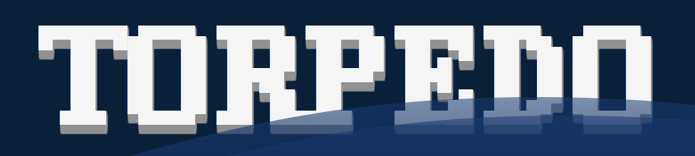

토피도는 수중 탄막 슈팅 웹 게임입니다.
동아리 [UnreVR](https://github.com/UNREVR)의 프로젝트로 개발하였습니다.  
개발기간은 7/14 ~ 7/19 5일입니다.

별도 명시가 없는 한 코드는 **GNU GPL 3.0**, 리소스는 **CC-BY-NC-SA 4.0**으로 배포됩니다.

**[torpedo.zlfn.space](torpedo.zlfn.space)** 에서 플레이 할 수 있습니다.

### 조작키
* 방향키로 이동
* 스페이스로 어뢰 발사
### 물고기

  
[Aseprite](https://github.com/aseprite/aseprite)로 그렸습니다.  
귀엽죠

### 아이템

  
각각 체력회복, 미사일 장전 속도 증가, 좌우 속도 증가, 상하 속도 증가입니다.

## CREDIT
### FRAMEWORK
  

### RESOURCE

* **DaisyUI** : https://daisyui.com (MIT)  
* **Material Tailwind** : https://www.material-tailwind.com/ (MIT)
* **SVG Ocean** (K.C.Ashish Kumar) : https://codepen.io/kcak11/pen/BYewdo
  * 

License (CC-BY like)

     Copyright (c) 2022 by K.C.Ashish Kumar (https://codepen.io/kcak11/pen/BYewdo) Permission is hereby granted, free of charge, to any person obtaining a copy of this software and associated documentation files (the "Software"), to deal in the Software without restriction, including without limitation the rights to use, copy, modify, merge, publish, distribute, sublicense, and/or sell copies of the Software, and to permit persons to whom the Software is furnished to do so, subject to the following conditions: The above copyright notice and this permission notice shall be included in all copies or substantial portions of the Software.  THE SOFTWARE IS PROVIDED "AS IS", WITHOUT WARRANTY OF ANY KIND, EXPRESS OR IMPLIED, INCLUDING BUT NOT LIMITED TO THE WARRANTIES OF MERCHANTABILITY, FITNESS FOR A PARTICULAR PURPOSE AND NONINFRINGEMENT. IN NO EVENT SHALL THE AUTHORS OR COPYRIGHT HOLDERS BE LIABLE FOR ANY CLAIM, DAMAGES OR OTHER LIABILITY, WHETHER IN AN ACTION OF CONTRACT, TORT OR OTHERWISE, ARISING FROM, OUT OF OR IN CONNECTION WITH THE SOFTWARE OR THE USE OR OTHER DEALINGS IN THE SOFTWARE.
  

  
* **Prevent Zoom** : https://codepen.io/Abdelrahman286/pen/XWXqwXL
  * 

License (CC-BY like)

     Copyright (c) 2023 by Abdelrahman (https://codepen.io/Abdelrahman286/pen/XWXqwXL) Permission is hereby granted, free of charge, to any person obtaining a copy of this software and associated documentation files (the "Software"), to deal in the Software without restriction, including without limitation the rights to use, copy, modify, merge, publish, distribute, sublicense, and/or sell copies of the Software, and to permit persons to whom the Software is furnished to do so, subject to the following conditions: The above copyright notice and this permission notice shall be included in all copies or substantial portions of the Software. THE SOFTWARE IS PROVIDED "AS IS", WITHOUT WARRANTY OF ANY KIND, EXPRESS OR IMPLIED, INCLUDING BUT NOT LIMITED TO THE WARRANTIES OF MERCHANTABILITY, FITNESS FOR A PARTICULAR PURPOSE AND NONINFRINGEMENT. IN NO EVENT SHALL THE AUTHORS OR COPYRIGHT HOLDERS BE LIABLE FOR ANY CLAIM, DAMAGES OR OTHER LIABILITY, WHETHER IN AN ACTION OF CONTRACT, TORT OR OTHERWISE, ARISING FROM, OUT OF OR IN CONNECTION WITH THE SOFTWARE OR THE USE OR OTHER DEALINGS IN THE SOFTWARE.
  

### Font
* **[삼국지3글꼴](https://github.com/hurss/fonts)** (leedheo) : (MIT)
* **[DOS이야기](https://github.com/hurss/fonts)** (leedheo) : (MIT)
* **Neo둥근모** (Dalgona) (SIL OpenFont License 1.1)
* **[달무리](https://ranolp.github.io/dalmoori-font/)** ([RanolP](https://github.com/RanolP)) : (MIT)
### Tool
* [WebStorm](https://www.jetbrains.com/webstorm/)
* [WolframAlpha](https://www.wolframalpha.com/)
* [Aseprite](https://github.com/aseprite/aseprite)